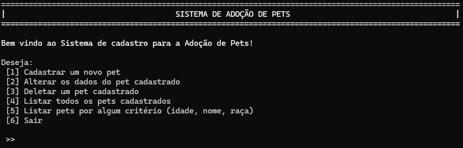

# Sistema para Adoção de Pets
É um sistema de cadastro para Adoção de Pets via CLI (interface de linha de comando), desenvolvido inteiramente com Java, que permite o cadastro, alteração, busca e exclusão de pets.

## Motivação
O projeto faz parte de um desafio feito pelo [@devmagro](https://www.linkedin.com/in/karilho/) para praticar os fundamentos do Java, tais como: POO, Exceções, Manipulação de arquivos, Manipulação de Collections (Set, Map, List) e arrays, Java IO, Enums, entre outros. 

Confira o [README](https://github.com/karilho/desafioCadastro#) com as regras do desafio

## Instalação
Pré-Requisitos:
- Versão 21.0.5 do JDK
- É aconselhavel ter uma IDE que suporte Java (ex: InteliJ, Eclipse, NetBeans) para executar o sistema, porém, caso prefira, pode-se utilizar o prompt de comando 

Instalação via download:
Na página do repositório clique em:
1. Code -> Local -> Download ZIP
2. Extraia o arquivo ZIP
3. Abra a pasta do sistema em sua IDE

Instalação via Git:
Na página do repositório clique em
1. Code -> Local
2. Copie a URL HTTPS
3. Em seu git digite o comando para clonar o projeto:
```bash
git clone [URL] SistemaAdocaoPets
```
4. Abra a pasta do sistema em sua IDE

### Atenção
Antes de executar, é preciso mudar os valores das constantes 'caminhoFormulario' e 'caminhoDirCadastro', atribuindo o caminho das pastas que estão no seu computador.

caminhoFormulario -> caminho da pasta que está o formulário
caminhoDirCadastro -> caminho da pasta onde ficam os arquivos txt's dos pets cadastrados

As constantes se encontram em src/app/Main.java no inicio do método main.

### Importante
1. Não altere qualquer pergunta do arquivo formulário, nem mesmo acrescente linhas vazias logo abaixo
2. Tome os mesmos cuidados com os arquivos dos pets cadastrados

## Utilização
Ao excecutar o sistema, um menu inicial exibirá as seguintes opções:
```bash
 [1] Cadastrar um novo pet
 [2] Alterar os dados do pet cadastrado
 [3] Deletar um pet cadastrado
 [4] Listar todos os pets cadastrados
 [5] Listar pets por algum critério (idade, nome, raça)
 [6] Sair
```
### Cadastrar pet
As perguntas de um formulário são lidas e o usuário deve inserir as respostas referentes ao pet. No final, um arquivo txt com as informações coletadas será criado dentro da pasta petsCadastrados. Todas as respostas possuem validação, portanto, é preciso atentar-se.

### Alterar cadastro
Permite a alteração das informações de um pet que foram cadastradas. Para isso, é realizada uma busca com base em determinados critérios escolhidos pelo usuário. O mesmo escolhe um dentre os encontrados e insere novas informações que substituirão as atuais.

### Deletar pet
Excluí um pet cadastrado. Um busca é realizada da mesma forma que no cadastro, então o usuário escolhe o pet que será excluido dentre os encontrados. Ao deletar um pet, o arquivo txt referente a ele também será excluido.

### Lista todos os pets
Exibe todos os pets cadastrados, ou seja, que possuem um arquivo txt, independentemente de critérios do usuário.

### Listar por critérios
Busca pets com base em alguns critérios ( um ou dois combinados). O resultado é exibido para o usuário.

### Sair
Encerra o programa.

## Contribuição
Todos os Pull Requests são bem vindos, então caso queira contribuir melhorando alguma funcionalidade, adicionando outras funcionalidades ou evidenciando erros, fique a vontade.

## Licença
[MIT](https://choosealicense.com/licenses/mit/)
